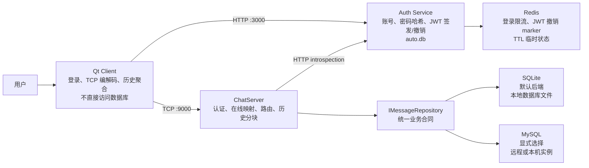

# ChatHub

ChatHub 是一个 Windows 本地开发的单机聊天项目：Qt 客户端通过 HTTP 登录取得 JWT，再通过 TCP 与 ChatServer 聊天；ChatServer
通过 Auth Service introspection 完成 TCP 新连接认证，并通过统一的 `IMessageRepository` 使用 SQLite 或 MySQL 持久化消息。
Redis 只保存登录限流和 JWT 撤销 marker 等带 TTL 的认证临时状态；SQLite 是默认消息后端，MySQL 需要在启动时显式选择。

本 README 只记录已实现且有验证证据的行为。需求、协议细节和故障复现分别见 [W10 需求](docs/W10需求文档-交付稳定性.md)、
[W11 MySQL 需求](docs/W11需求文档-MySQL集成与存储抽象.md)、[W12 Redis/认证需求](docs/W12需求文档-Redis临时状态与认证安全.md)、[W13 工程交付需求](docs/W13需求文档-工程交付与可重复验证.md)、
[协议总图](docs/ChatHub协议字段与状态流向总图.md)、[W13 演示与人工验收脚本](docs/W13演示与人工验收脚本.md)、
[W13 Release Checklist](docs/ReleaseChecklist-W13.md) 和 [W13 交接文档](docs/交接文档-2026-08-31-W13-工程交付与可重复验证.md)。

## 1. 单机架构与数据所有权



| 组件                   | 拥有的状态                                                 | 不负责的事                               |
|----------------------|-------------------------------------------------------|-------------------------------------|
| Qt Client            | 登录态、TCP 连接、在线快照缓存、`m_conversations` UI 模型             | 不直接操作数据库或伪造发送者身份                    |
| Auth Service         | 用户账号、bcrypt 密码哈希、JWT 签发、Redis 登录限流与撤销 marker          | 不维护在线状态、消息路由或聊天历史                   |
| ChatServer           | TCP Session、通过 Auth introspection 得到的认证用户名、待送达索引、消息路由 | 不直接读取 Redis，不信任客户端正文中的发送者身份         |
| `IMessageRepository` | ChatServer 的消息持久化业务接口；由 SQLite 或 MySQL 后端实现           | 不操作 UI/TCP Socket，不向上层暴露 SQL 或数据库句柄 |

`local_id` 由发送客户端生成，用于重试和更新既有气泡；`message_id` 由 ChatServer 首次成功入库时生成，用于持久身份、历史去重和送达回执；
`request_id` 只关联一轮历史查询。三者不能互换。

## 2. 当前边界

- 单机、单 ChatServer；不支持多服务器路由。
- `online_users` 是完整快照，最多 88 个、每个 3–20B 的 ASCII 用户名；不分页、不分块。
- 单条聊天正文最多 1024B，所有协议帧正文最多 2048B。
- 无离线推送、多端同步、群聊或好友关系；Redis 仅用于登录限流和受控 JWT 撤销，不保存聊天正文或用户密码；消息存储支持默认 SQLite 和显式选择的 MySQL，两种后端保持相同业务合同。
- `PendingDeliveryMap` 只存在于 Server 进程内；重启后历史中的本人消息最多恢复为 `Accepted`，不会伪造为 `Delivered`。
- ChatServer 的新 TCP auth 通过 `CHATHUB_AUTH_INTROSPECTION_URL` 和内部服务密钥调用 Auth Service；Auth Service 再验证 JWT 并查询 Redis
  撤销 marker。不要把内部密钥、签名密钥、JWT 或数据库内容写入 README、Git、日志或测试夹具。
- 启动日志会输出实际数据库路径与认证超时；会话错误日志已统一为带 `session_id`、`phase`、`event`、`code` 的结构化记录，并且不回显入站
  `error` 正文。

## 3. Windows 依赖与首次配置

需要 CMake 3.21+、Ninja、与 Qt 匹配的 C++17 MinGW、Qt 6（Core/Gui/Widgets/Network）、Node.js/npm，以及 Docker Desktop + Compose。
项目的 `vcpkg.json` 声明 C++ 直接依赖；MinGW 构建必须使用 `x64-mingw-dynamic`，不能把 MSVC 的 `x64-windows` 库混入其中。

共享的 [CMakePresets.json](CMakePresets.json) 不保存个人路径或秘密：其中的 `debug-base` 是公共 Debug 基础，`ci-windows-mingw-debug` 供 CI 通过环境变量使用。
每位开发者在已忽略的 `CMakeUserPresets.json` 中创建自己的 `windows-mingw-debug`、build 与 test preset，或让 CLion 生成等价的本机配置。它需要映射以下本机输入：MinGW 编译器/Ninja、Qt 根目录、vcpkg toolchain 和 `x64-mingw-dynamic`。不要把这个文件提交。

Auth Service 首次使用时在 `auth-service` 目录运行 `npm install`。其私有 `.env` 提供 `CHATHUB_REDIS_URL`、`SECRET_KEY` 和
`CHATHUB_AUTH_INTERNAL_SERVICE_KEY`；`.env`、`auto.db`、测试生成的临时目录和任何 token 都是本机数据，不能提交或粘贴到记录中。

## 4. 构建与自动化验证

### 4.1 本地 CMake/CTest

先在仓库根目录用本机 User Preset 配置和构建；`ctest` 不会自动编译，所以顺序不能颠倒：

```powershell
cmake --preset windows-mingw-debug
cmake --build --preset windows-mingw-debug-build
ctest --preset windows-mingw-debug-test
```

本机的已记录基线为 23 个注册 CTest 中 `13 Passed、10 Skipped、0 Failed`。`Skipped` 表示 MySQL 专项缺少专用环境门禁，**不是通过**；
它也不代表 Redis、完整 Auth E2E 或生产 MySQL 已由 CTest 覆盖。每次需要交付时都必须重新运行命令并记录当次计数。

### 4.2 Auth Service 与真实跨进程 E2E

以下测试使用真实 Redis、真实 Auth Service 和真实 ChatServer 子进程；它们各自创建临时 Auth/SQLite 数据、唯一用户名与 Redis prefix，
只清理本次资源，不使用 `FLUSHDB`。所有 E2E 都占用 Auth 的固定端口 `3000`，因此先关闭手动启动的 Auth Service，并按顺序运行。

```powershell
Set-Location .\auth-service
$env:CHATHUB_REDIS_TEST_URL = 'redis://127.0.0.1:6380'
$env:CHATHUB_CHAT_SERVER_EXECUTABLE = (Resolve-Path '..\cmake-build-debug-mysql\chat-server\chat-server.exe')

npm test
npm run test:e2e
npm run test:three-client
npm run test:ten-client
npm run test:twenty-client
npm run test:authenticated-disconnect
npm run test:mysql-write-failure
npm run test:auth-dependency-failure
```

`test:e2e` 覆盖 logout 后新 TCP 连接拒绝、旧已认证连接仍按当前合同可用；3/10/20 客户端脚本验证受控顺序下的认证、ACK、转发、送达和关闭统计。
它们不是吞吐、最大容量或并发竞争基准。MySQL 写入失败脚本只停止自己的 TCP 代理，不停止共享 Compose MySQL；Auth 依赖失败脚本只停止自己创建的 Auth 子进程。

CI 使用公开 Qt 6.10.1 的 Windows/MinGW 路由，执行 `unit|network|process|qt` 并排除 `mysql|redis`。因此 CI 绿灯不能被写成 MySQL、Redis 或全部 E2E 已通过。

提交前至少执行：

```powershell
git status --short
git diff --check
git diff --cached --check
```

构建产物、`*.db`、`.env`、token、日志正文、录像原始文件和本地学习资料不应暂存。

## 5. 启动与关闭顺序

### 5.1 Compose 基础设施依赖

Compose 只编排 MySQL 和 Redis；Auth Service、ChatServer、Qt Client 始终是 Windows 主机进程。首次使用时仅在私有 `.env` 尚不存在时创建它：

```powershell
Copy-Item .env.example .env
docker compose config -q
docker compose up --wait --wait-timeout 90
docker compose ps
```

在私有 `.env` 中填写 MySQL 密码，绝不提交它。`config -q` 必须以退出码 0 结束；`ps` 中 MySQL 与 Redis 都必须是 `healthy`。
当前 Compose 将 MySQL 映射为 `127.0.0.1:3307`、Redis 映射为 `127.0.0.1:6380`，不向局域网开放。

`docker compose down` 移除 container/network 但保留 named volume；`docker compose down -v` 还会删除 MySQL/Redis 本地数据，旧数据库内容和未过期 Redis marker 都不能再假定存在。只有盘点并确认可删除后才可执行后者。

### 5.2 主机应用进程

1. Compose Redis 健康后，在 `auth-service` 中用私有 `.env` 启动 `npm start`。Auth Service 必须先连接 Redis 和打开 SQLite，成功后才监听本机 `3000`。
2. 设置 `CHATHUB_AUTH_INTROSPECTION_URL` 和 `CHATHUB_AUTH_INTERNAL_SERVICE_KEY` 后启动 ChatServer。默认 SQLite 示例：

   ```powershell
   New-Item -ItemType Directory -Force .\run-data
   .\cmake-build-debug-mysql\chat-server\chat-server.exe `
     --port 9000 `
     --database-path .\run-data\chathub.db `
     --auth-timeout-ms 5000
   ```

   MySQL 是显式后端：使用 `--storage-backend mysql`、`--mysql-host 127.0.0.1`、`--mysql-port 3307`、私有 `.env` 中对应的用户名/数据库名，
   并只经进程环境提供 `CHATHUB_MYSQL_PASSWORD`。MySQL 参数不能与 `--database-path` 混用；连接、认证插件或 Schema 初始化失败会在监听前非零退出。去掉全部 `--mysql-*` 参数即可回到 SQLite。
3. 启动两个 Qt Client，分别注册/登录临时演示账号。完整的人工路径见 [W13 演示与人工验收脚本](docs/W13演示与人工验收脚本.md)。
4. 停止时先关 Qt Client，再分别在 ChatServer 和 Auth Service 控制台按 `Ctrl+C`。不要把 `run-data`、`.env` 或 `auto.db` 纳入 Git。

## 6. TCP 协议速查

每帧固定 8B 头部：魔数 `0x4348`、版本 `1`、`type`、正文长度；正文上限 2048B。

|  type | 名称                 | 方向与作用                                                                              |
|------:|--------------------|------------------------------------------------------------------------------------|
|     1 | `chat`             | Client 发送 `{ to, content, local_id, send_at }`；Server 持久化后向接收方转发带 `message_id` 的消息 |
| 2 / 3 | `ping` / `pong`    | 心跳请求与响应                                                                            |
|     4 | `error`            | `{ scope, code, message, local_id? }`；带 `local_id` 时定位发送方失败气泡                      |
|     5 | `auth`             | Client 发送 JWT；成功响应 `{ ok: true }`                                                  |
|     6 | `chat_ack`         | `{ local_id, message_id, status: "accepted", server_received_at_ms }`              |
|     7 | `delivery_receipt` | 接收方以 `message_id` 回执；Server 向发送方回传 `{ local_id, status: "delivered" }`             |
|     8 | `online_users`     | `{ users: [...] }` 完整在线用户快照                                                        |
|     9 | `history_query`    | `{ request_id, limit, before? }`；身份只从认证 Session 推导                                 |
|    10 | `history_result`   | `{ request_id, messages, is_last_chunk, has_more, next_cursor }`；按实际编码字节分块         |

本期常见稳定错误码包括：`database_unavailable`、`database_write_failed`、`database_read_failed`、`invalid_username_claim`、
`online_snapshot_capacity_exceeded`、`authentication_timeout`。测试应断言 `scope/code`，不依赖展示文案。

## 7. 演示与验收路径

演示不替代测试。人工演示只用于观察 UI 和真实启动顺序；logout 新连接拒绝与受控依赖故障由专用 E2E 脚本提供可重复证据。
按 [W13 演示与人工验收脚本](docs/W13演示与人工验收脚本.md) 执行并记录：基础设施健康、构建/CTest 入口、双账户聊天、ChatServer 重启后的历史、
`npm run test:e2e` 的 logout 新连接拒绝，以及 `npm run test:mysql-write-failure` 的受控故障。不得把尚未填写的人工记录写成验收通过。

## 8. 项目文档

- [W10 交付稳定性需求](docs/W10需求文档-交付稳定性.md)
- [W13 工程交付与可重复验证需求](docs/W13需求文档-工程交付与可重复验证.md)
- [协议字段与状态流向总图](docs/ChatHub协议字段与状态流向总图.md)
- [W13 演示与人工验收脚本](docs/W13演示与人工验收脚本.md)
- [W13 Release Checklist](docs/ReleaseChecklist-W13.md)
- [W13 工程交付与可重复验证交接](docs/交接文档-2026-08-31-W13-工程交付与可重复验证.md)
- [W10 故障记录](docs/故障记录/W10-交付稳定性故障记录.md)
- [文档索引](docs/README.md)
