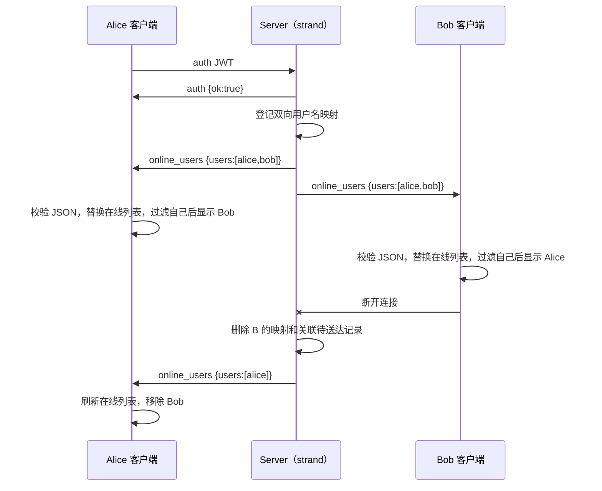

# W8-10 在线状态需求文档

> 状态：已完成并验收（2026-08-12）。后续改动仍以本文档的协议和边界为准。

## 1. 目标与用户可见结果

在既有“认证用户名 → 在线会话”映射的基础上，让每个已认证客户端收到**当前在线用户的完整快照**，并在 Qt 主窗口中显示可用的在线联系人。

用户可观察到：

1. Alice 认证成功后，Alice 的在线列表出现 Bob（若 Bob 已在线）；
2. Bob 认证成功后，Alice 与 Bob 都会收到最新列表；每人界面只显示其他用户，不显示自己；
3. Bob 正常断开、网络断开或被服务器关闭后，Alice 的列表自动移除 Bob；
4. 点击一个在线用户名只把它填入 `recipientEdit`，方便开始私聊；不创建空会话、不改变当前会话、不发送消息；
5. 已有私聊、未读数、会话排序与最终送达回执均不受影响。

## 2. 设计选择：全量快照，不发送增量事件

本功能采用一个由服务端单向推送的 `online_users` 帧，正文为当前状态的完整快照：

```json
{ "users": ["alice", "bob", "carol"] }
```

认证成功或认证用户断开时，服务端重新构造并广播该快照。客户端用新快照整体替换本地在线用户名列表。

选择快照的原因：

- 客户端无需保存和修复一长串“上线/下线”增量事件；
- 重复收到同一快照是幂等的，直接刷新即可；
- 新认证的客户端第一次就能得到完整列表；
- 当前 V1 没有重连状态同步、版本号或持久化，快照的状态边界最清楚。

“上线/下线通知”在本功能中是**服务端重新广播快照的触发时机**，不是再增加两种协议帧。

## 3. 范围与非目标

### 本轮范围

- 新增 `online_users = 8` 协议类型；
- 服务端认证成功、认证用户断开后广播快照；
- 客户端校验并发出 `onlineUsersChanged(QStringList)`；
- Qt 增加只读在线用户列表，点击项仅回填接收者输入框；
- 协议解析单元测试、双客户端人工验收与回归构建。

### 明确不做

- 好友关系、陌生人筛选、拉黑、头像、状态文本、最后在线时间；
- 离线消息、数据库持久化、跨重连补发；
- 多端同时保持在线；本版本采用**一个用户名只保留一个活动会话，新连接顶替旧连接**的策略；
- 客户端向服务端主动请求名单；名单只由服务端推送；
- 点击在线用户后自动创建会话、置顶、清未读或发送消息。

## 4. 现有基础与数据所有权

服务端已具备以下唯一真相：

```text
m_username_to_session : username -> SessionId
m_session_to_username : SessionId -> username
m_sessions            : SessionId -> SessionPtr
```

这三张表只在 `Server::m_strand` 上访问。在线名单只能从**已认证用户映射** `m_username_to_session` 推导，不能用 `m_sessions`
，因为后者也包含尚未认证的 TCP 连接。

客户端由 `ChatClient::m_online_users` 缓存最后一份有效快照，`MainWindow::m_onlineUsers` 保存当前界面模型；两者来源只能是服务端快照。
`QListWidget` 只是显示层，不得成为状态来源。主窗口创建较晚时，先连接 `onlineUsersChanged`，再主动读取
`ChatClient::onlineUsers()` 回填，避免错过登录阶段到达的瞬时信号。`m_conversations` 仍只保存真实聊天消息，不能混入在线用户名或空会话。

## 5. 协议契约

| 项目             | 约定                                                                     |
|----------------|------------------------------------------------------------------------|
| 帧类型            | `MessageType::online_users = 8`                                        |
| 方向             | 仅 Server → 已认证 Client                                                  |
| 正文             | `{ "users": ["username", ...] }`                                       |
| 名单内容           | 所有当前已认证且仍在用户名映射中的用户名；服务端按字典序输出以避免 `unordered_map` 迭代顺序造成 UI 抖动         |
| 客户端显示          | 过滤当前用户名后显示其他用户；服务端正文仍保留全量真实状态                                          |
| 用户名规则          | 非空字符串，沿用认证服务用户名约束；单个用户名不得超过现有帧体限制                                      |
| 帧体限制           | 总正文继续受 `kMaxFrameBodyLength = 1024` 限制；超出时服务端不得发送截断或不完整快照，应记录并采取明确失败策略 |
| 客户端收到非法正文      | 发出 `serverError`，保留上一份有效在线列表，不清空 UI                                    |
| 客户端主动发送 type=8 | 协议违规；服务端不把它当聊天路由，也不改变在线状态                                              |

`online_users` 不是消息状态帧，因此没有 `local_id`、`from`、`to`、未读数或送达回执。

## 6. 生命周期与时序



顺序要求：认证成功时，先完成用户名/会话双向映射，再广播；断开时，先删除映射和待送达记录，再广播。未认证连接的建立与断开不触发名单广播。

## 7. 模块职责与 API 规划

### 7.1 协议与服务端

**文件：** `chat_protocol.h`、`server.h/.cpp`、`session.cpp`。

- `MessageType` 和 `isKnownMessageType()` 同步支持 type=8；
- `Server::buildOnlineUsersBody()`：从 `m_username_to_session` 收集、排序、编码 JSON；不访问 UI、不修改在线表；
- `Server::broadcastOnlineUsers()`：仅遍历已认证用户名映射，找到仍存在的 `SessionPtr` 后发送 type=8；不接受客户端请求；
- 同名新连接认证成功时：先找到并关闭旧 `Session`，再把 `username -> SessionId` 更新为新会话，并登记新会话反向映射；
- 旧会话随后触发 `removeSession()` 时，只有当 `m_username_to_session[username]` 仍等于该旧
  SessionId，才允许删除正向映射；若映射已指向新会话，只删除旧的反向映射与会话对象，不能误删新映射；
- 认证回调完成上述登记/顶替后调用广播；
- `removeSession()` 仅在确实移除了认证映射时调用广播；未认证会话断开不广播；
- `Session::handlerMessage()` 不把客户端发来的 `online_users` 交给普通聊天路由。

**重复登录策略（已确定）：** 新连接顶替旧连接。旧会话必须通过 `close()` 自然进入既有断开清理路径，不能手工删除 `m_sessions`
；断开清理必须比较 SessionId，避免旧会话的延迟断开误删新会话的正向用户名映射。旧会话被替换后不跨连接迁移待送达记录。

### 7.2 ChatClient

**文件：** `chatclient.h/.cpp`。

- 新增信号：`void onlineUsersChanged(const QStringList& users);`；
- 新增私有处理函数：`void handleOnlineUsersBody(const QByteArray& body);`；
- 在 `dispatchFrame()` 中把 type=8 分派给该函数；
- 解析时必须依次验证：合法 JSON、根是对象、存在 `users`、`users` 是数组、每个数组元素是非空字符串、没有重复用户名；
- 校验成功才组装 `QStringList` 并发信号；失败只发 `serverError`，不把部分数组交给 UI。

ChatClient 缓存最后一份**已校验**的在线名单、但不直接操作 `QListWidget`
，以保持网络层与界面层分离；开始新连接或连接结束时统一清空缓存并发出空快照，避免旧会话状态泄漏到新窗口。

### 7.3 MainWindow 与 UI

**文件：** `mainwindow.ui`、`mainwindow.h/.cpp`。

- 在左侧会话面板增加 `onlineUsersLabel` 和 `onlineUsersList`，放在当前用户标签与会话列表之间；初始禁用/空白；
- MainWindow 私有保存 `QStringList m_onlineUsers`，并提供 `updateOnlineUsers(const QStringList&)`：替换模型、过滤
  `m_username`、按固定顺序重建 `onlineUsersList`；
- 连接 `onlineUsersChanged` 到该更新函数；认证成功后仅等待服务端快照，断开后清空本地在线名单并禁用列表；
- 点击 `onlineUsersList` 中的用户名时，只写 `ui->recipientEdit->setText(username)` 并在状态栏提示；不调用
  `ensureConversationItem()`、`moveConversationItemToTop()` 或 `renderCurrentConversation()`；
- 列表项用 `Qt::UserRole` 保存用户名；即使当前显示文本日后增加状态，也不能从文字反查身份。

## 8. 分块实施顺序

每块按“你实现 → 我仅检查本块 → 构建/测试 → 你人工验收 → 记录”闭环后再进入下一块。

1. **协议常量：** 只新增 type=8 及 known-type 上界；不发送、不解析、不改 UI。
2. **服务端快照构造：** 在 Server strand 内从认证映射生成排序 JSON；为正常、空名单、超长正文确定可测试行为。
3. **同名顶替防线：** 先让 `removeSession()` 仅删除仍指向自己的正向映射；随后在认证回调中实现“关闭旧会话 → 更新为新映射”的顶替策略。
4. **服务端广播时机：** 接入认证成功与认证用户断开两个边界；确保先改映射再广播，且未认证断开不广播。
5. **客户端解析与信号：** 增加 type=8 分派、严格 JSON 校验和 `onlineUsersChanged`；添加有效/非法正文测试或可重复的手工注入验证。
6. **Qt 列表显示：** 新增控件、私有模型、刷新函数、断开清理与点击回填；不改变现有会话模型。
7. **端到端验收：** 使用 Alice/Bob/Carol 分别验证首次认证、后续上线、断线下线、自己过滤、点击回填、私聊回归和同名顶替。

## 9. 验收矩阵

| 场景             | 预期结果                                       |
|----------------|--------------------------------------------|
| Alice 单独认证     | 收到含 Alice 的快照；Alice UI 不显示自己，在线列表为空        |
| Bob 随后认证       | Alice 显示 Bob；Bob 显示 Alice；两端名单无重复且顺序稳定     |
| Carol 随后认证     | Alice/Bob 显示 Carol；Carol 显示 Alice、Bob      |
| Bob 断开         | Alice/Carol 的下一份快照不含 Bob；会话记录与未读数不被删除      |
| 未认证 TCP 连接断开   | 已认证客户端不收到名单变动                              |
| 非法 type=8 JSON | 客户端报告错误，保留原有效在线列表                          |
| 点击 Carol       | 只回填 `recipientEdit` 为 Carol，不创建会话项、不置顶、不发送 |
| 回归私聊           | A→B 聊天、Accepted、Delivered、未读数、会话排序仍正确      |
| Alice 同名新连接认证  | 新会话成为用户名映射目标；旧会话关闭；旧会话稍后断开也不得删除新映射         |

## 10. 完成定义与后续边界

完成本功能必须满足：构建成功、现有 CTest 全绿、上述正常与断线场景人工验收通过，且协议非法正文不会破坏已有 UI 状态。

本功能已完成：W8 的“在线用户列表 / 上线 / 下线通知”主项结束；同名登录已采用并验收“新连接顶替旧连接”策略。

## 11. 实现与验收记录（2026-08-12）

- 协议新增 `online_users = 8`，并将其纳入 `isKnownMessageType()`；服务端只在认证成功或认证映射真实移除后广播完整、字典序稳定的
  JSON 快照。
- `Server` 使用正反向会话映射处理同名登录：新会话先接管用户名映射，旧会话随后断开时只清理自己的反向映射，不误删新映射；所有映射访问保持在
  `Server::m_strand`。
- `ChatClient` 严格校验 JSON 对象、`users` 数组、非空字符串和重复用户名；成功后更新缓存并发 `onlineUsersChanged`
  ，失败保留上一次有效快照。
- `MainWindow` 在左侧显示在线用户，过滤本人；点击项只回填 `recipientEdit`，不会创建会话、置顶、清未读或发送消息。
- 已执行全量构建与 CTest（2/2 通过），并完成双客户端人工验收：先后登录、上下线同步、本人过滤、点击回填、私聊回归和同名登录接管均通过。定位期间确认必须运行最新构建的客户端，旧构建不包含本协议处理。
