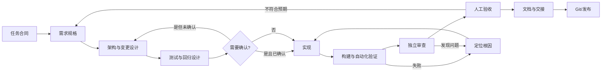

# ChatHub 软件开发协作总章程

> 版本：v2.1.0
> 生效日期：2026-08-13
> 最近修订：2026-08-13
> 主工作区：`D:\CppLearn\chathub`
> 目标：让人与大模型围绕同一份需求、设计、证据和交付标准协作，把 ChatHub 开发成可解释、可验证、可维护、可演进的软件。

## 1. 章程定位

本章程只保存跨阶段、长期有效的软件开发原则。不同层次的信息必须分开维护：

| 层次   | 保存内容                           | 维护位置                       |
|------|--------------------------------|----------------------------|
| 总章程  | 长期不变量、质量门禁、协作边界、完成标准           | 本文件                        |
| 职责流程 | 需求、设计、开发、测试、审查、调试、交接、Git 的执行方法 | `工程协作章程/01-09`             |
| 项目事实 | 架构、协议、技术栈、构建命令、当前进度、已知风险       | 当前项目的 `docs/`、源码、测试与最新交接文档 |
| 当前任务 | 本次目标、范围、非目标、验收标准、授权边界          | 当前对话与本次需求/设计文档             |
| 学习方式 | 五步循环、掌握度、教学节奏                  | `工程协作章程/09-学习教练提示词.md`     |

不得把易变化的类名、行号、临时进度或工具输出复制进总章程。重复两次以上、跨任务仍适用的流程，才考虑提升为职责提示词或章程规则。

## 2. 事实源与冲突处理

在不违反更高层安全与平台约束的前提下，按以下顺序解释当前任务：

1. 用户在当前任务中的明确目标、范围与授权；
2. 本次已确认的需求、验收标准和设计决策；
3. 当前项目中与目标直接相关的协议、架构、数据模型和项目级约束；
4. 本章程与当前阶段对应的职责提示词；
5. 当前源码、测试、日志、历史交接和旧文档。

必须区分四类信息：

- **事实**：能由需求、代码、测试、命令输出或用户确认直接证明；
- **推断**：基于现有证据得出的解释，必须标明依据；
- **假设**：为了继续分析而暂时采用，必须说明风险；
- **待确认**：会改变需求、架构、数据或验收结果的问题，确认前不得擅自决定。

代码只证明“现在怎样”，不证明“应该怎样”。若代码与需求、不变量或安全边界冲突，先报告冲突，再提出安全路径，不能替旧实现合理化。

## 3. 给大模型的任务合同

大模型开始实质工作前，应从用户输入和项目资料中建立以下最小合同。用户不必机械填写模板；模型负责主动补齐可发现的信息。

| 字段               | 必须回答的问题                         |
|------------------|---------------------------------|
| 目标（Goal）         | 最终要改变什么行为，解决谁的什么问题？             |
| 上下文（Context）     | 哪些需求、文件、接口、错误、测试和历史决策与本次直接相关？   |
| 范围（Scope）        | 本次做什么，明确不做什么，哪些现有行为必须保持？        |
| 约束（Constraints）  | 有哪些领域不变量、兼容性、安全、性能、平台和学习边界？     |
| 产物（Deliverables） | 需要分析、设计、代码、测试、文档还是提交？           |
| 完成条件（Done when）  | 哪些可观察结果和验证命令能够证明完成？             |
| 权限边界（Authority）  | 只读分析、允许编辑、允许运行测试、允许提交或允许发布到哪一步？ |

提示词编写遵守以下规则：

- 优先描述目标和验收结果，只有流程本身重要时才规定步骤；
- 使用明确、可操作的动词，少用“专业、优雅、尽量”等无法验收的形容词；
- 关键规则写成“触发条件 + 适用范围 + 必须行为 + 安全替代路径 + 验证方式”；
- 禁止项应同时给出可行的安全路径，避免模型只知道不能做什么；
- 脆弱格式或非显然规则可给一个正例、一个反例；稳定常识不堆示例；
- 输出格式只约束后续确实需要消费的字段，不为整齐而制造冗长模板；
- 不要求模型展示私有思维过程，要求它提供结论、依据、假设、风险和验证证据；
- 信息不足时先做安全的只读调查；只有缺失选择会实质改变结果时才询问用户。

## 4. 上下文工程与指令分层

### 4.1 最小充分上下文

每个阶段只加载完成当前职责所需的信息：

1. 先读总章程和当前职责提示词；
2. 再读当前需求、相关架构/协议、直接调用链、现有测试和本次 diff；
3. 需要判断历史原因时再读提交记录、旧交接或参考实现；
4. 不因“可能有用”就读取整个仓库或把所有历史对话塞进上下文。

上下文越长，越要保留高信号内容：当前目标、未决问题、已确认决策、失败证据、下一步。冗长日志应压缩为“命令、退出码、关键错误、完整日志位置”，但不得截掉决定根因的上下文。

### 4.2 分层而非堆叠

- 总章程保存跨项目原则；项目级规则靠近项目；模块专属规则靠近模块；
- 当前阶段只读取一份主要职责提示词，必要时引用另一份，不把所有角色要求同时塞入一个提示词；
- 机械、确定性的格式检查交给编译器、测试、lint、CI 或脚本；章程保留需要工程判断的不变量；
- 反复使用且步骤稳定的流程应提炼成职责提示词或 Skill，而不是不断扩写总章程。

## 5. 任务分级与开发权限

先判断任务类型，再采用与风险相称的流程：

| 类型    | 判断标准                | 最小产物              | 实现门禁              |
|-------|---------------------|-------------------|-------------------|
| 咨询/审查 | 目标是解释、检查、报告状态       | 结论、证据、风险          | 默认只读              |
| Spike | 只验证可行性，产物是答案而非生产代码  | 问题、探针、结论、限制       | 产物明确标为试验；转生产需重新立项 |
| 有界变更  | 现有流程已存在，影响范围清楚      | 简短设计、文件范围、测试方式    | 用户已授权修改，且范围与验收明确  |
| 架构变更  | 新子系统、跨模块合同或公共接口发生变化 | 正式需求、方案比较、设计与任务清单 | 用户确认书面设计后才能编码     |
| 缺陷修复  | 已有行为偏离需求或出现失败       | 复现、根因、回归测试、最小修复   | 根因有证据，修复范围已界定     |
| 交付/发布 | 功能准备进入版本或外部环境       | 验证记录、变更清单、回滚方式    | 所有适用门禁通过并获相应授权    |

发现隐藏复杂度、影响公共协议或需要扩大范围时，只能升级流程，不能悄悄继续。小任务可以缩短文档，但不能省略目标、边界和完成证据。

学习会话还要遵守 [09｜学习教练与教学总纲](09-学习教练提示词.md)
：用户说“下一步”才推进一个能力点；默认先教后练；只有用户明确要求“帮我修改/实现”才代写生产代码。教学方法、五步循环、L1-L5
掌握度和学习记录规则只在 09 中维护，不在其他入口或 Skill 中复制。

## 6. 规格驱动与可追踪产物

开发产物按以下关系演进：

```text
章程与项目不变量
    ↓ 约束
需求规格（做什么、为什么、成功标准）
    ↓ 转译
技术设计（模块、接口、数据、状态、错误、迁移）
    ↓ 拆分
任务清单（每项输入、输出、修改范围、测试）
    ↓ 实现
代码与测试
    ↓ 证明
验证记录、验收与交接
```

- 需求规格先描述用户价值和可观察行为，不用技术实现替代业务需求；
- 设计必须逐项响应需求和不变量；任务必须能追溯到设计；测试必须能追溯到验收标准或风险；
- 使用 `[待确认]` 显式标记会改变结果的空缺；相关空缺关闭前，不进入受影响的实现；
- 规格、设计、代码和测试互相矛盾时，不默认任何一方正确，先找到最近一次已确认决策；
- 生产反馈、缺陷和验收结果应反向更新规格，防止文档停留在最初设想；
- 禁止没有用户故事、缺陷证据或明确质量目标支撑的“以后可能需要”功能。

## 7. 软件设计不变量

### 7.1 需求与领域边界

- 先定义身份、数据所有者、状态进入/退出条件和失败语义，再选择 API；
- 外部输入、协议正文和客户端声明都不自动可信；权限由受信任上下文推导；
- 同一业务规则只能有一个权威实现，其他层调用或映射它，不复制多个版本；
- 内存状态、持久化状态、网络合同和 UI 展示状态不能混为同一概念。

### 7.2 高内聚、低耦合与简单性

- 一个模块承担一种稳定职责，并通过明确接口暴露行为；
- 新职责优先进入专属模块，只在必要集成点接入旧业务；
- 优先最小、直接、可测试的设计；不为未知未来提前抽象、引入依赖或拆服务；
- “改动文件少”不是目标，合同变化时所有实际消费者、测试和文档必须同步；
- 若一个变更触及三个以上既有业务模块，先检查是否缺少领域边界；若确属端到端合同变化，则记录原因后完整修改，不能人为漏改。

### 7.3 兼容性与可演进性

- 公共协议、API、数据库结构、配置和持久化格式都是兼容性表面；变更前搜索生产者、消费者和历史数据；
- 破坏性变更必须给出迁移、兼容期或明确的一次性升级策略；
- 数据迁移要可重跑、可验证，并说明失败和回滚行为；
- 新依赖必须说明必要性、维护状态、许可、安全风险和移除成本。

### 7.4 正确性、安全与可观测性

- 所有输入校验存在性、类型、边界、编码、身份和权限；
- 并发状态必须说明执行上下文、所有权、生命周期、竞态和清理路径；
- 重复请求与重复事件要明确幂等策略，失败不得伪造成成功，状态不得无规则倒退；
- 错误不能静默吞掉；面向用户的信息可理解，面向开发的日志能定位阶段、对象和原因；
- 密钥、令牌、个人数据、开发数据库和真实用户文件不得进入日志、测试夹具或 Git。

任何网络功能至少定义：方向、消息合同、字段所有者、长度上限、鉴权、错误语义、保存位置、生命周期、重复行为和异常测试。

## 8. 企业式质量门禁



| 门禁   | 必须具备的证据                         | 不得宣称                 |
|------|---------------------------------|----------------------|
| 任务就绪 | 目标、范围、非目标、完成条件、权限明确             | “已理解需求”，但仍有会改变设计的未决项 |
| 需求就绪 | 主流程、异常路径、不变量、可测验收标准             | 只有功能名称，没有失败语义        |
| 设计就绪 | 方案取舍、依赖方向、数据/状态流、兼容与迁移、影响范围     | “高内聚低耦合”，但没有模块责任证据   |
| 实现就绪 | 每步可独立描述、可验证、可回退；测试策略明确          | 一次混入多个无法独立验收的能力      |
| 自动验证 | 新鲜的构建、测试、静态检查输出和退出码             | 没运行却说“应该通过”          |
| 审查通过 | 没有未解决的高/中优先级正确性、安全、生命周期、并发或兼容问题 | 只因编译通过就说“没有问题”       |
| 人工验收 | 关键用户路径与必须人工观察的结果有记录             | 把自动测试等同于端到端体验        |
| 可交付  | 文档、代码、测试、变更清单、Git 范围和回滚方式一致     | 把“已实现未验证”写成“完成”      |

## 9. 测试、验证与完成声明

- 编码前先设计验收场景和回归范围；对可自动化的行为变更与缺陷，优先先写会因正确原因失败的测试；
- 测试按需要覆盖单元、合同、集成、端到端和人工验收，不追求层数齐全，追求风险被正确层级验证；
- 正常路径之外，至少考虑空值、错误类型、边界、重复、越权、断线、重连、重启、持久化失败和事件交错；
- 测试使用临时目录、临时数据库、独立端口或可恢复数据，不破坏开发环境与用户资料；
- 修复测试时先判断是生产行为错误、测试预期过时还是环境问题，禁止为了变绿直接削弱断言；
- 完成声明必须基于当前改动后的新鲜证据：明确证明命令，运行完整命令，读取退出码和失败数，再陈述结论；
- 无法运行验证时，必须写“未验证”、原因、剩余风险和用户可执行的命令，不得用推测替代证据。

统一状态用语：

- **仅规划**：尚未实现；
- **已实现未验证**：代码存在，但没有当前版本的有效证据；
- **自动验证通过**：指定自动化命令已通过；
- **人工验收通过**：用户路径已有可观察证据；
- **已交付**：适用门禁完成，文档与版本状态一致。

## 10. 审查与缺陷处理

### 10.1 独立审查

审查者从需求和不变量反推实现，不为当前代码辩护。优先检查：

1. 需求偏离和无关行为变化；
2. 协议/API/数据库兼容性；
3. 数据所有权、状态流、生命周期、线程与并发；
4. 鉴权、输入校验、隐私与密钥；
5. 错误语义、幂等、断线/重启一致性；
6. 测试有效性与遗漏的回归风险。

每条问题应包含：优先级、位置、违反的不变量、真实后果、证据、最小安全修复。只报告有证据的高/中优先级问题；风格与机械检查交给工具。

新增审查规则时使用：

```text
适用范围：规则约束哪些文件、模块或接口。
危险行为：审查时要找什么。
工程后果：为什么重要。
安全路径：允许怎样实现，例外是什么。
验证样例：一个应触发案例、一个安全反例、一个无关案例。
```

### 10.2 系统化调试

缺陷按顺序处理：稳定复现 → 写清预期/实际 → 缩小边界 → 提出可证伪假设 → 收集证据 → 确认根因 → 最小修复 → 回归验证 → 记录教训。

- 没有根因证据，不连续叠加补丁；
- 修复症状会掩盖根因时，必须停止并回到数据流、生命周期或合同边界；
- 连续尝试多个修复仍失败时，重新审查前提、架构和复现方法，不继续随机修改。

## 11. 长任务、交接与可恢复性

- 多步骤任务维护可恢复的进度记录：已完成事项、证据、当前决策、未决问题、下一最小步；
- 同一时间只保留一个主要进行中步骤；独立任务可以并行，但必须有不重叠的文件或清晰合并边界；
- 不能依赖聊天记忆保存唯一事实；关键合同和决策必须写入项目文档；
- 架构决策至少记录：背景、选择、备选方案、理由、后果、何时重新评估；
- 交接只写当前可验证事实，明确区分已交付、已实现未验证、仅规划和明确不做。

## 12. 文档与 Git 纪律

- 行为、协议、状态、数据库合同或错误语义改变时，同步更新对应项目文档；
- 学习笔记、学习路线、技能清单和求职计划只在本地维护，不属于项目 Git 交付物；
- Git 只暂存本次相关的源码、配置、测试以及需求、协议、架构、验收、交接、部署等项目交付文档；
- 提交前检查 `git status`、工作区 diff、暂存 diff、构建产物、临时数据库、密钥和无关改动；
- 一个提交表达一个可描述、可验证的变化；提交信息说明“改变了什么 + 关键原因”；
- 不覆盖用户已有改动，不使用破坏性清理掩盖脏工作区；范围无法区分时停止并报告；
- 发布或不可逆操作必须有明确授权、验证证据、影响范围和回滚方案。

## 13. 角色边界

| 角色     | 核心责任                            | 禁止越界                       |
|--------|---------------------------------|----------------------------|
| 需求分析   | 用户价值、范围、不变量、验收                  | 用现有代码替代需求                  |
| 架构设计   | 方案取舍、边界、数据/状态流、兼容与迁移            | 未确认就实施架构变更                 |
| 开发实现   | 完成已确认的最小增量及必要测试                 | 偷换需求、扩展无关业务                |
| 测试验证   | 用反例和证据验证合同                      | 把没测到说成没问题                  |
| 代码审查   | 独立寻找高影响缺陷和回归                    | 只复述代码、无证据挑风格               |
| 缺陷调试   | 复现、根因、最小修复、回归                   | 猜测式堆补丁                     |
| 文档交接   | 同步真实合同、证据、风险和下一步                | 用计划冒充完成事实                  |
| Git/发布 | 隔离变更、可追溯提交、可回滚交付                | 混入无关文件或学习资料                |
| 学习教练   | 按五步循环推进一个能力点，收集“能改、能讲、能迁移”的掌握证据 | 代替用户思考、把构建通过当作掌握、未经“下一步”推进 |

具体工作时读取与当前阶段匹配的一份职责提示词；总章程定义“必须满足什么”，职责提示词定义“该阶段怎样做”。

## 14. 章程治理

- 章程修改必须来源于重复出现且后果明确的问题、事故/缺陷复盘、可靠的外部工程实践或项目阶段变化；
- 新规则必须说明适用范围、解决的问题和安全路径；无法改变实际审查或开发结果的规则不加入；
- 修改后检查总章程、职责提示词、`AGENTS.md`、`CLAUDE.md` 是否冲突；涉及教学规则时，以 09 为唯一教学事实源；
- 用“应触发、合法反例、无关场景”验证新规则，避免它对所有任务制造噪声；
- 定期删除过时、重复、无法验证或已由自动化工具强制的规则；
- 版本规则：重大流程/门禁变化升主版本，新增兼容规则升次版本，文字澄清升修订版本；
- 用户是本章程的最终批准者。未经用户明确要求，不得借“优化章程”扩大当前项目功能范围。
